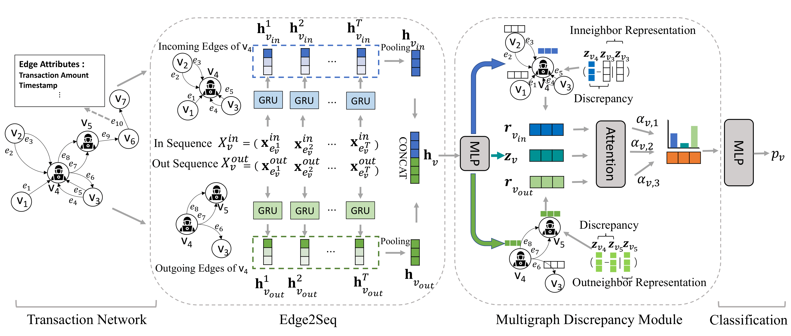

# DIAM
This repository is an official PyTorch(Geometric) implementation of DIAM in "Effective Illicit Account Detection on Large Directed MultiGraph
Transaction Networks of Cryptocurrencies".



## Requirements

- Python==3.9
- torch==1.12.0+cu116
- torch-geometric==2.2.0
- scikit-learn==1.1.1
- scipy==1.8.1
- numpy==1.22.4
- dgl-cu116==0.8.2.post1

## Data

| Dataset                            | #Nodes     | #Edges      | #Edge attribute | #Illicit | #Normal  | Illicit:Normal |
|------------------------------------|------------|-------------|------------------|-----------|-----------|----------------|
| Ethereum-S | 1,329,729  | 6,794,521   | 2                | 1,660     | 1,700     | 1:1.02         |
| Ethereum-P      | 2,973,489  | 13,551,303  | 2                | 1,165     | 3,418     | 1:2.93         |
| Bitcoin-M   | 2,505,841  | 14,181,316  | 5                | 46,930    | 213,026   | 1:4.54         |
| Bitcoin-L                         | 20,085,231 | 203,419,765 | 8                | 362,391   | 1,271,556 | 1: 3.51        |

We provide **two ways** to obtain the datasets:

### Option 1: Original distribution (SharePoint)
Download the four datasets from the authors' original link, then extract them into the `./data` folder:

- [datasets (SharePoint)](https://connectpolyu-my.sharepoint.com/:f:/g/personal/22040455r_connect_polyu_hk/Eql0SlCGirNOsxT_X6qIfHkBTb2PNVM2JWVV9IEQmPAAoA)

After extraction, follow the usage steps below (e.g., `preprocess.py`, then `main.py`).

### Option 2: 🤗 Hugging Face mirror (`.npz` graph dict)
We also mirror the datasets on Hugging Face in a **stable `.npz` format**, where each file stores a single large graph as a **graph dictionary**:

- Hugging Face dataset repo:  
  https://huggingface.co/datasets/Tommy-DING/crypto-illicit-account-detection-multigraphs

Files provided:
- `EthereumS_graph_dict.npz`
- `EthereumP_graph_dict.npz`
- `BitcoinM_graph_dict.npz`
- `BitcoinL_graph_dict.npz`

Each `*_graph_dict.npz` includes:
- `edge_index`: shape `[2, E]` (COO edge list)
- `edge_attr`: shape `[E, D]` (edge features)
- `X`: shape `[N, F]` (node features)
- `y`: shape `[N]` with labels in `{-1, 0, 1}` (`-1`: unknown, `0`: benign, `1`: illicit)

> Note: This repository (DIAM) uses PyTorch Geometric. If you prefer the original `.pt` files and the official end-to-end pipeline, please use this GitHub repo directly.  
> The Hugging Face version is intended for easier downloading and broader interoperability.

## Usage
1. Download and extract data files to `/data` folder.
2. Generate edge sequences.

    `python3 preprocess.py`

3. Run DIAM.
   
    `python3 main.py`

## Citation
```bibtex
@inproceedings{ding2024effective,
  title={Effective illicit account detection on large cryptocurrency multigraphs},
  author={Ding, Zhihao and Shi, Jieming and Li, Qing and Cao, Jiannong},
  booktitle={Proceedings of the 33rd ACM International Conference on Information and Knowledge Management},
  pages={457--466},
  year={2024}
}
```
