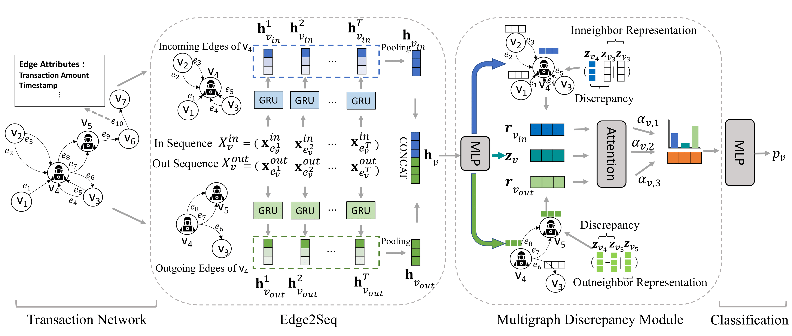

# DIAM
This repository is an official PyTorch(Geometric) implementation of DIAM in "Effective Illicit Account Detection on Large Directed MultiGraph
Transaction Networks of Cryptocurrencies".

## Requirements

- Python==3.9
- torch==1.12.0+cu116
- torch-geometric==2.2.0
- scikit-learn==1.1.1
- scipy==1.8.1
- numpy==1.22.4
- dgl-cu116==0.8.2.post1

## Data

| Dataset                            | #Nodes     | #Edges      | #Edge attribute | #Illicit | #Normal  | Illicit:Normal |
|------------------------------------|------------|-------------|------------------|-----------|-----------|----------------|
| Ethereum-S | 1,329,729  | 6,794,521   | 2                | 1,660     | 1,700     | 1:1.02         |
| Ethereum-P      | 2,973,489  | 13,551,303  | 2                | 1,165     | 3,418     | 1:2.93         |
| Bitcoin-M   | 2,505,841  | 14,181,316  | 5                | 46,930    | 213,026   | 1:4.54         |
| Bitcoin-L                         | 20,085,231 | 203,419,765 | 8                | 362,391   | 1,271,556 | 1: 3.51        |

The four datasets can be downloaded here: 	[datasets](https://connectpolyu-my.sharepoint.com/:f:/g/personal/22040455r_connect_polyu_hk/Eql0SlCGirNOsxT_X6qIfHkBTb2PNVM2JWVV9IEQmPAAoA)
## Usage
1. Download and extract data files to `/data` folder.
2. Generate edge sequences.

    `python3 preprocess.py`

3. Run DIAM.
   
    `python3 main.py`
